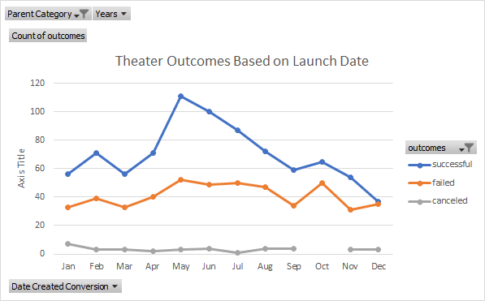
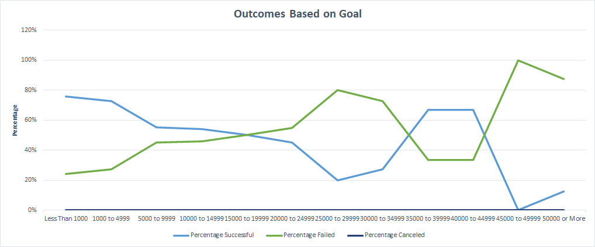

# Kickstarter-Analysis-Challenge
Analysis of data for Kickstarter Campaign
# Kickstarting with Excel

## Overview of Project

### Purpose
Louise is interested in comparing the outcome of her play, with the outcomes and success of other plays.  This analysis will include the goals, outcomes, and release dates of all plays in the dataset. 
The purpose of this analysis is to compare the outcomes of successful plays, and whether they met their goals, to Louise’s play.  This will better help Louise on her next play, increase her chances of having a successful play that meets its goals.  
## Analysis and Challenges

### Analysis of Outcomes Based on Launch Date
The theater produced a total of 1369 Kickstarter campaigns, of those 1047 were plays. When the outcomes of all theater Kickstarter campaigns are compared to the dates, specifically the month, in which the campaign started, there is a clear trend of successful campaigns that start in the months of May, June and July. May and June had twice as many successful campaigns as failed campaigns (111 compared to 52 and 100 compared to 49, respectfully), where July was almost twice as successful (87 successes compared to 50 failures). The least successful months to start a Kickstarter campaign is November, December, and January.  During these months, the number of successful campaigns and failed campaigns are almost the same. March is also similar to these months, and should also be considered a month in which a campaign should not be started.  

### Analysis of Outcomes Based on Goals
In the 1047 plays in the dataset, 694 were successfully funded, while 353 fell short of their goal. The most successful campaigns had goals under $5,000, with a donation average of $80.74. There is also success of reaching the goal for those campaigns that asked for $35,000 to $45,000.  The least successful goals were those who asked for $5,000 to $35,000 and even less success at meeting the goal were those campaigns that asked for over $45,000, with an average donation of $47.85.  

### Challenges and Difficulties Encountered
Since this is a very large dataset, it was difficult at first to breakdown the data in a way that made sense to me. I understand the pivot tables, but deciding which variable goes where was a little confusing. The “countifs” command was a little strange at first; not understanding the way the rules rely on each other, but it completely makes sense to me now.  
## Results

- What are two conclusions you can draw about the Outcomes based on Launch Date?
1. Campaigns that are started during the summer months are twice as successful.  
2. Campaigns that are started in winter months, are the least successful campaigns for theater.  
- What can you conclude about the Outcomes based on Goals?
    The most successful goals were those under $5,000 and between $35,000 to $45,000.  The most successful Kickstarter campaigns had an average donation of $80.74, with the average donation for failed campaigns being $47.85.    
- What are some limitations of this dataset?
    Although this dataset is very large, the dates are now considered old and outdated (2009-2017).  This could lead to some extrapolation on my part, if the trends didn’t say the same.  This is also under the assumption that the pandemic didn’t change anything, or that we are making conclusions before the pandemic. When analyzing just theater, we are comparing musicals, plays and space.  In my mind, it seems silly to include spaces, so I tried to filter my data to just plays as much as I could.  It would also be nice if the data could include how successful the outcome was; how much money was made, how long did the show/movie/etc run for.  This could help understand what is successful and why to help with creating successful Kickstarter campaigns. I would also like to note that we are comparing different currencies, which are not all equivalent. I believe it would have been best to convert all money into one currency to have a consistent comparison.   
- What are some other possible tables and/or graphs that we could create?
   I created tables to help me breakdown the donations, to see what the average of the average donations were for plays that were successful or failed.  This could be an early indicator of if the Kickstarter will end up being fully funded or not, but just as a guideline. In my theater outcomes based on launch date, I filtered my data by just plays, to see how this compares to all theater campaigns. The graph shows the same data, meaning that musicals and spaces didn’t change the conclusion on which months are successful and which months are not. 

